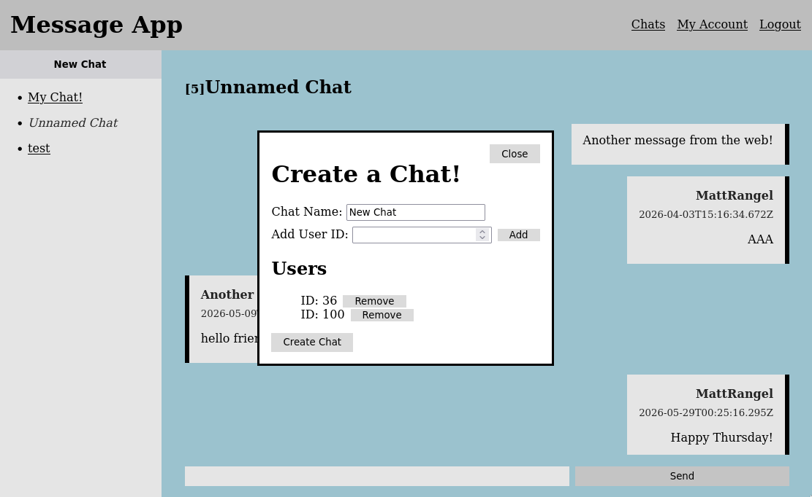
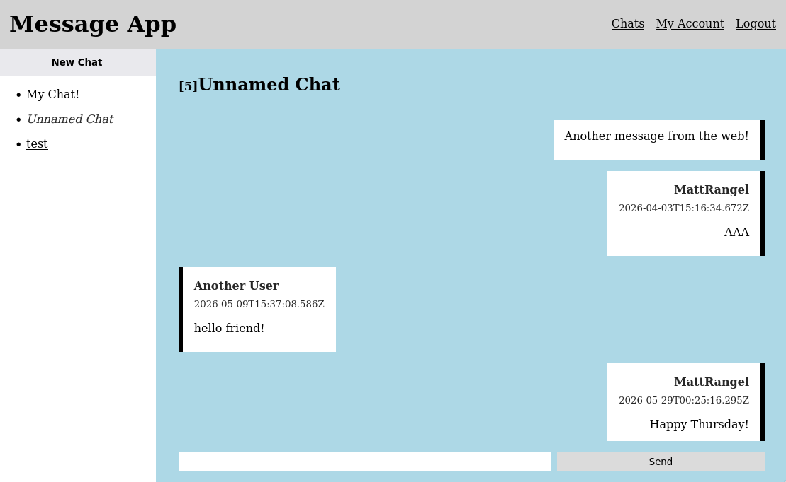
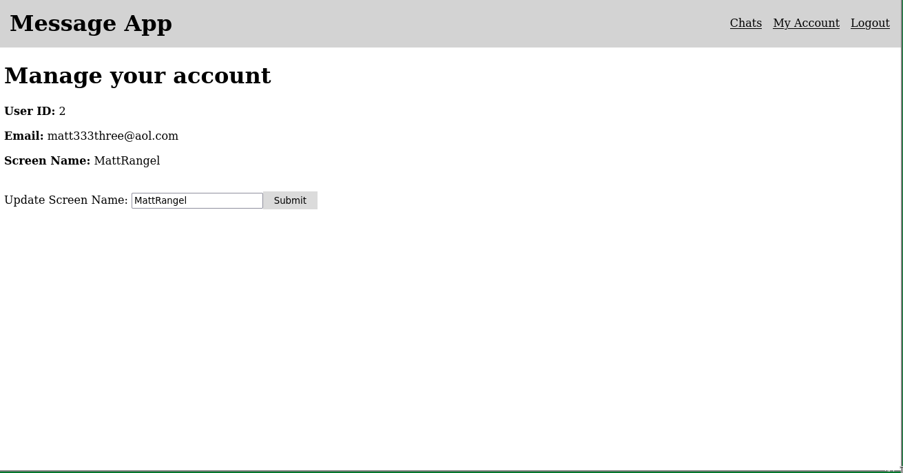
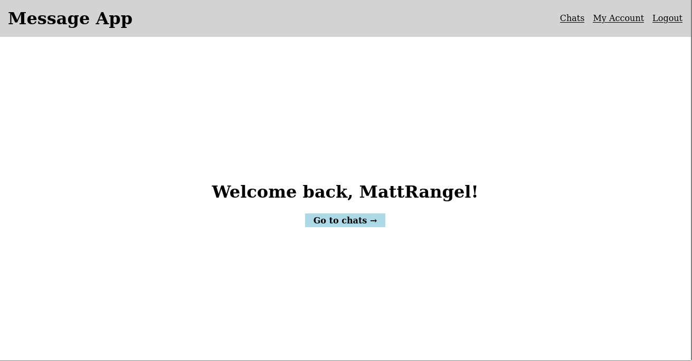
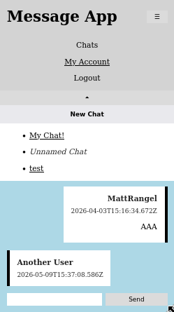

# Messaging App
This project was made as my last assignment in [The Odin Project](https://www.theodinproject.com).

Find project instructions [here](https://www.theodinproject.com/lessons/react-new-messaging-app).

## Screenshots
### Desktop

### Mobile

